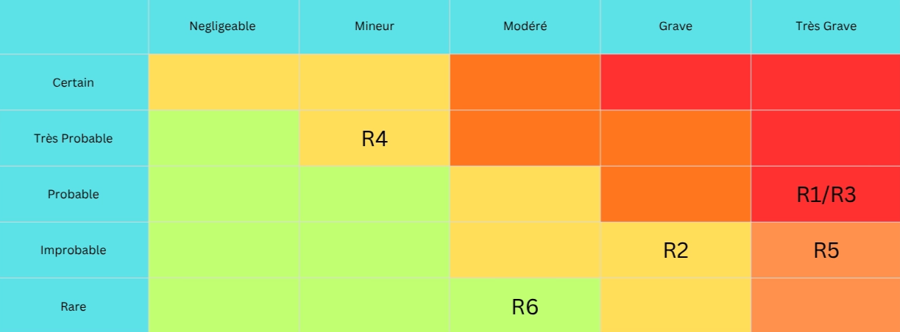

# PLANIFICATION

1. Backlog produit : rédigez au minimum 20 user stories au format
En tant que [rôle], je veux [action]afin de [bénéfice]. Priorisez-les selon la méthode MoSCoW.
2. Plan de release : organisez les user stories en 3 sprints de 2 semaines. Justifiez vos choix de priorisation.
3. Matrice des risques : identifiez 6 risques minimum, évaluez leur probabilité et impact (faible /moyen / élevé), et proposez une stratégie de réponse pour chacun.

## Backlog produit DuoQ

Must have : Indispensable au lancement
Sans ces fonctionnalités, le produit ne peut pas exister

- US01
En tant que *visiteur*, je veux *créer un compte avec un pseudonyme, email et mot de passe* afin de *rejoindre la plateforme de façon sécurisée*.
Authentification
- US02
En tant que *nouvel utilisateur*, je veux *remplir un questionnaire de profil gamer* (jeux préférés, plateformes, style de jeu, disponibilités) afin de *permettre à l'algorithme de trouver des profils compatibles*.
Profil
- US03
En tant que *nouvel utilisateur*, je veux *choisir mon type de rencontre recherché* (Manette / Joystick / Alien Pixel / PC) afin de *m'assurer que les profils proposés partagent mes intentions*.
Profil
- US04
En tant que *utilisateur authentifié*, je veux *consulter une liste de profils suggérés selon mes affinités de jeux* afin de *découvrir des gamers qui me correspondent*.
Matching
- US05
En tant que *utilisateur*, je veux *gg, ff go next ou GOAT un profil* afin d'*exprimer mon intérêt de façon nuancée*.
Matching
- US06
En tant que *utilisateur*, je veux *être notifié d'un match mutuel* afin de *savoir quand une conversation peut débuter*.
Notifications
- US07
En tant que *utilisateur ayant obtenu un match*, je veux *voir le questionnaire complet de mon match* afin de *disposer d'un sujet de conversation concret pour briser la glace*.
Matching
- US08
En tant que *utilisateur matché*, je veux *envoyer et recevoir des messages texte* afin de *communiquer avec mes matchs directement sur la plateforme*.
Messagerie
- US09
En tant que *utilisateur souhaitant accéder aux fonctionnalités explicites*, je veux *passer une vérification d'âge* (18+) afin de *garantir la conformité légale et la protection des mineurs*.
RGPD / Légal
- US10
En tant que *utilisateur*, je veux *consulter, modifier et supprimer mes données personnelles* afin d'*exercer mes droits RGPD à tout moment*.
RGPD / Légal

Should have : Important mais pas bloquant
Fortement attendu, à intégrer rapidement après le MVP

- US11
En tant que *utilisateur*, je veux *lier mon compte Discord à mon profil DuoQ* afin de *proposer facilement une session de jeu à un match*.
Discord
- US12
En tant que *utilisateur*, je veux *lancer une invitation DuoQ Date directement depuis la messagerie* afin d'*inviter un match à jouer ensemble sans quitter l'app*.
Discord
- US13
En tant que *utilisateur*, je veux *signaler un profil comme inapproprié* afin de *contribuer à la sécurité de la communauté*.
Modération
- US14
En tant que *utilisateur*, je veux *bloquer un autre utilisateur* afin de *ne plus recevoir ses messages ni voir son profil*.
Messagerie
- US15
En tant que *utilisateur*, je veux *mettre à jour mon profil et mon questionnaire* afin de *refléter l'évolution de mes goûts et disponibilités*.
Profil
- US16
En tant que *utilisateur*, je veux *recevoir des notifications push ou email lors d'un match ou message* afin de *ne manquer aucune interaction importante*.
Notifications
- US17
En tant que *modérateur*, je veux *consulter les signalements et suspendre des comptes* afin de *maintenir un environnement sain et conforme à la charte*.
Modération

Could have : Souhaitable si le temps le permet
Améliore l'expérience sans être critique

- US18
En tant que *utilisateur*, je veux *voir un score de compatibilité affiché sur chaque profil* afin de *visualiser rapidement mon niveau d'affinité avec un autre gamer*.
Matching
- US19
En tant que *utilisateur*, je veux *ajouter une photo ou un avatar personnalisé à mon profil* afin de *me rendre plus identifiable et attractif*.
Profil
- US20
En tant que *utilisateur*, je veux *filtrer les profils par jeu, région ou disponibilité horaire* afin d'*affiner ma recherche selon mes critères prioritaires*.
Matching
- US21
En tant que *utilisateur*, je veux *consulter la liste de mes anciens matchs et conversations* afin de *retrouver facilement des profils avec lesquels j'ai interagi*.
Messagerie
- US22
En tant que *utilisateur*, je veux *partager mon profil DuoQ via un lien* afin d'*inviter des amis ou me promouvoir sur les réseaux sociaux*.
Social

Won't have (v1) : Hors périmètre pour la version initiale
À reconsidérer en v2 selon les retours utilisateurs

- US23
En tant que *utilisateur*, je veux *rejoindre des rooms de tchat thématiques par jeu* afin de *rencontrer plusieurs gamers simultanément dans un espace communautaire*.
Communauté
- US24
En tant que *utilisateur premium*, je veux *accéder à un abonnement payant débloquant des Super Likes illimités et la visibilité boostée* afin de *maximiser mes chances de matchs*.
Monétisation

## Plan de release

Sprint 1 : 

**Objectif :** application fonctionnelle, matchable et conforme RGPD

**Users Stories :** 12

Les 10 Must Have forment le cœur du produit : sans eux, DuoQ n'existe pas. US09 et US10 sont intégrés dès ce sprint car la collecte de données sensibles (intentions relationnelles, profil gaming) déclenche immédiatement les obligations RGPD — les déployer plus tard exposerait le projet à un risque légal bloquant. US13 et US17 sont avancés pour les mêmes raisons : une plateforme de rencontres sans modération opérationnelle dès le lancement est un risque communautaire majeur.

Sprint 2 :

**Objectif :** compléter les Should Have et intégrer les Could Have prioritaires

**Stories :** 9

L'intégration Discord (US11, US12) constitue une fonctionnalité différenciante de DuoQ : elle est placée en tête de sprint pour maximiser la valeur perçue dès la deuxième livraison. US14, US15 et US16 complètent le socle de qualité attendu par les utilisateurs. Les Could Have sont traités dans ce sprint car ils améliorent significativement l'expérience de matching (score de compatibilité, filtres, avatar) sans dépendances techniques lourdes, et permettent d'absorber un éventuel retard du sprint 1.

Sprint 3 : 

**Objectif :** Won't Have prioritaires, finition et rattrapage des retards

**Stories :** 2+ buffer

Ce sprint joue un double rôle. En premier lieu, il intègre les Won't Have les plus stratégiques : US24 (monétisation) et US25 (import automatique du profil gaming) sont des fonctionnalités à fort potentiel qui nécessitent des dépendances externes (API Steam, passerelle de paiement) justifiant leur report en v1.1. En second lieu, il constitue un buffer planifié pour absorber les stories qui auraient glissé depuis les sprints précédents, une réalité courante dans les projets en équipe réduite. US22 (partage de profil) est traité ici car sa valeur est conditionnée à une base d'utilisateurs existante.

## Matrice des risques

**R1 - Non-conformité RGPD avec données sensibles**

**R2 - Manque de compétences sur la technologie utilisée**

**R3 - Fuite de données** 

**R4 - Absence d’un membre de l’équipe**

**R5 - Absence de versioning / perte de code**

**R6 - Rôles non définis / travail en doublon**

