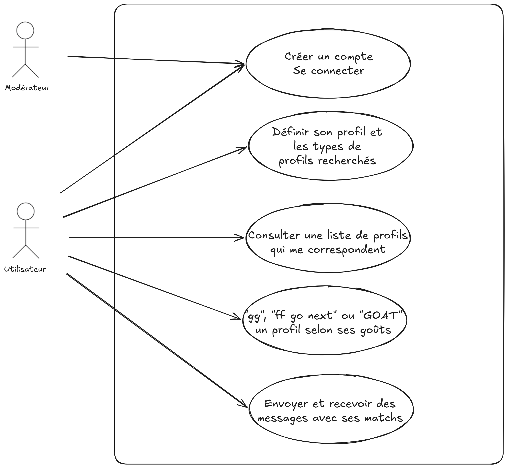
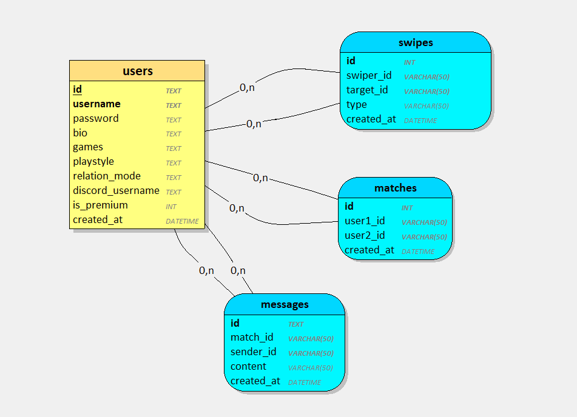

# CONCEPTION

## Diagramme use-case

Ci-dessous un diagramme de cas d'utilisation de DuoQ avec deux parties prenantes de l'application : l'utilisateur et le modérateur. Nous avons mis 5 fonctionnalités principales de l'application qui sont des "must-have" à implémenter.

## Diagramme de classe

Ci-dessous un diagramme de classe (MCD) représente les objets métiers de l'application. Nous avons 4 entités métiers qui sont les utilisateurs, les messages, les matchs et les swipes :
- users représente les utilisateurs et les données de leurs profils.
- swipes représente le swipe qu'effectue un utilisateur sur un autre (GG, FF go next et GOAT) afin que l'application puisse créer un match et/ou retirer un utilisateur de l'affichage de celui-ci. 
- matches représente les matchs entre deux utilisateurs lorsqu'ils se sont like mutuellement.
- messages représente les messages envoyés entre deux utilisateurs. A cause d'un manque de temps, nous n'avons pas mis en place un système de messagerie avec un websocket. A la place nous avons intégré les messages comme une entité à part entière.

Les associations s'expliquent comme suit :
- Un utilisateur **swipe** 0 à n utilisateurs. Un utilisateur *est swipe* par 0 à n utilisateurs.
- Un utilisateur **match** avec 0 à n utilisateurs. Un utilisateur *a match* avec 0 à n utilisateurs.
- Un utilisateur **échange des messages** avec 0 à n utilisateurs. Un utilisateur *a reçu* des messages de 0 à n utilisateurs.

## Diagramme de séquence

Ci-dessous le diagramme de séquence représente les appels d'API entre les différents environnements comme ils sont sur l'application : le client, le backend Express, le SQLite et Discord.

