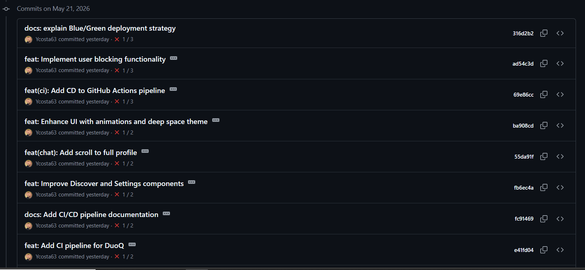

# DÉVELOPPEMENT

## README
Voir [**README.md**](../README.md)

## Workflow Git

Ce document décrit la stratégie de gestion de versions (Git Workflow) adoptée pour notre projet. Nous utilisons une approche inspirée de **GitFlow**, adaptée pour une intégration et un déploiement continus fluides.

### Branches

1. **`main`** (ou `master`) :
   - Branche de **production**.
   - Le code sur cette branche doit *toujours* être stable, testé et prêt à être déployé.
   - On ne commit **jamais** directement sur `main`. Les modifications proviennent uniquement de fusions (Merge Requests / Pull Requests) depuis `develop` ou `hotfix`.
   - Chaque fusion sur `main` s'accompagne d'un *tag* de version (ex: `v1.0.0`, `v1.1.0`).

2. **`develop`** :
   - C'est la branche d'**intégration** (ou branche de pré-production / staging).
   - Elle contient le code des prochaines fonctionnalités à livrer.
   - Les développeurs codent à partir de `develop`.
   - Une fois intégrées et testées, les modifications de `develop` sont fusionnées dans `main` pour la mise en production (souvent complété via une branche de `release`).
   - *A cause de notre outil de développement, il n'a pas été possible de créer une branche develop. Google IA Studio ne push que sur master.*

### Cycle de vie d'une Feature Branch

**1. Création de la branche (Développeur)**  
Le développeur s'assure d'être à jour et crée une nouvelle branche à partir de `develop` :
```bash
git checkout develop
git pull origin develop
git checkout -b feature/questionnaire-match
```

**2. Développement et Commits**  
Le développeur travaille sur sa fonctionnalité et effectue plusieurs commits clairs et isolés :
```bash
git add src/components/Login.tsx
git commit -m "feat: ajout des questions au formulaire d'inscription"

git add src/components/Chat.tsx
git commit -m "feat: affichage du questionnaire type dans la messagerie"

# Pousse la branche sur le dépôt distant
git push -u origin feature/questionnaire-match
```

**3. Pull Request / Merge Request (PR/MR)**  
Une fois la fonctionnalité terminée, le développeur ouvre une Pull Request (PR) sur la plateforme d'hébergement :
- **Source** : `feature/questionnaire-match`
- **Destination** : `develop`
- **Titre** : `feat: Questionnaire de match personnalisé`
- **Description** : Liste ce qui a été fait, contexte fonctionnel et éventuelles captures d'écran.

**4. Code Review**  
Les membres de l'équipe examinent le code proposé.
- Les relecteurs peuvent demander des ajustements ; dans ce cas, le développeur met à jour sa branche avec de nouveaux commits.
- Lorsque tout est validé, la PR est approuvée.

**5. Intégration (Merge)**  
Une fois validée et tous les tests continus (CI) au vert, la branche est fusionnée dans `develop` :
- Généralement, on favorise la stratégie **"Squash and Merge"** pour regrouper tous les petits commits de la PR en un seul commit propre sur `develop` (ou **"Merge commit"** standard).
- La branche locale et distante `feature/questionnaire-match` est ensuite supprimée pour garder le projet propre.

```bash
# Opération généralement effectuée depuis l'interface web (GitHub/GitLab)
git checkout develop
git merge --no-ff feature/questionnaire-match
git push origin develop
git branch -d feature/questionnaire-match # Nettoyage local
```

**6. Étape future (Déploiement)**  
Lors de la prochaine itération de livraison, la branche `develop` entière (qui inclut maintenant notre nouvelle feature) sera ramenée sur `main` pour être mise en production.


### Conventions de commit

Nous utilisons la convention de commit de **Conventional Commits**.
